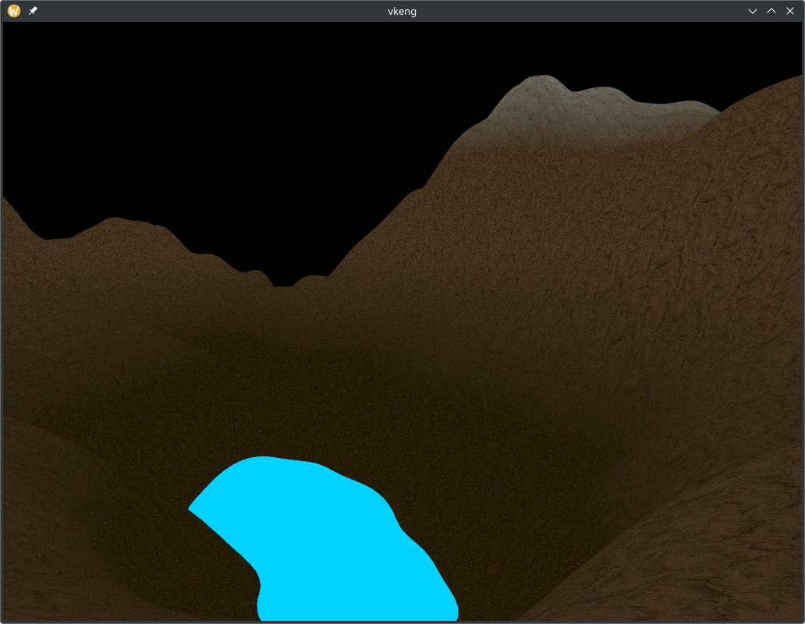

# Vulkan toy renderer

This is a Vulkan renderer slash demo that I created for a university project course during which
I learnt Vulkan from scratch. The code is utterly awful but is posted here for posterity.

What does it do? Renders crude procedurally generated terrain, mostly. It doesn't have any configurable features
or anything, because implementing those would've been extra work that wouldn't have really contributed towards
my progress on the course.

# Dependencies

- Vulkan (duh)
- SDL2
- glslc to compile shaders
- [Vulkan-Hpp](https://github.com/KhronosGroup/Vulkan-Hpp)
- [Vulkan Memory Allocator](https://github.com/GPUOpen-LibrariesAndSDKs/VulkanMemoryAllocator/)
- [GLM](https://github.com/g-truc/glm)

# Compiling

Compile the vkeng CMake target. Easiest way: open the project in CLion and press the green play button.

